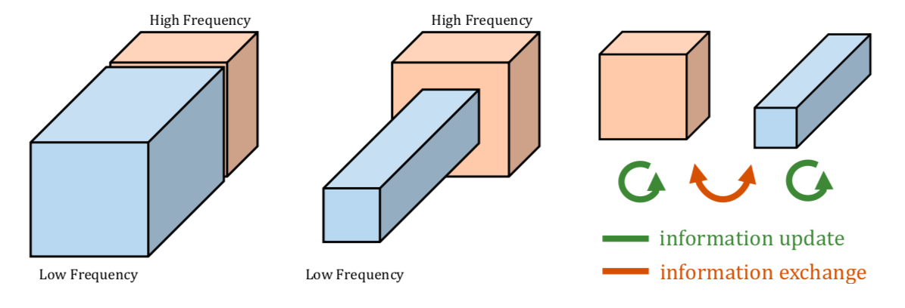

# OCTAVE_CONVOLUTION

This is a keras implementation of the paper [Drop an Octave: Reducing Spatial Redundancy in Convolutional Neural Networks with Octave Convolution.](https://arxiv.org/abs/1904.05049)

### Separating the low and high spatial frequency signal

The output maps of a convolution layer can also be factorized and grouped by their spatial frequency |  The output maps of a convolution layer can also be factorized and grouped by their spatial frequency.  |   The proposed Octave Convolution operates directly on this representation. It updates the information for each group and further enables information exchange between groups.:-------------------------:|:-------------------------: |:-------------------------: 
The output maps of a convolution layer can also be factorized and grouped by their spatial frequency |  The output maps of a convolution layer can also be factorized and grouped by their spatial frequency.  |   The proposed Octave Convolution operates directly on this representation. It updates the information for each group and further enables information exchange between groups.

### The spatial frequency model shows that natural image can be decomposed into a low and a high spatial frequency part. 

